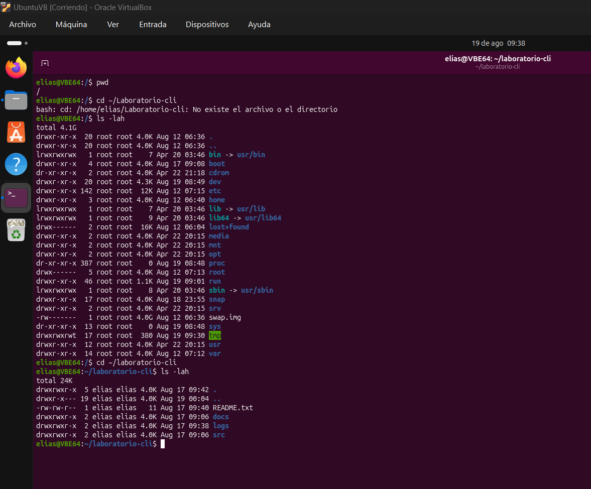

# Permisos de Archivos y Directorios

A continuación se detallan los permisos de los archivos y directorios:

|Dir     |Permisos|
|        |        |
| README | 6-6-4  |
| docs   | 7-7-5  |
| logs   | 7-7-5  |
| src    | 7-7-5  |

## Captura de Terminal

https://github.com/EliasOscarDV/LINUX3C

